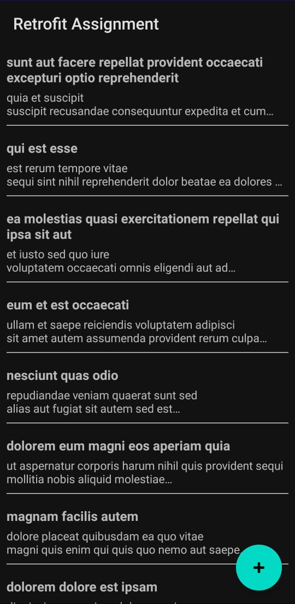

# Laporan Proyek Aplikasi Android - Retrofit & REST API

## A. Tujuan

Aplikasi ini dibuat untuk memenuhi tujuan pembelajaran berikut:

- Menggunakan library Retrofit untuk berkomunikasi dengan REST API.
- Mengambil data dari API melalui GET request.
- Mengirim data baru ke API melalui POST request.
- Menampilkan daftar data menggunakan RecyclerView.
- Mengintegrasikan Antarmuka Pengguna (UI) dengan proses request API.
- Menangani kondisi galat (error) seperti koneksi gagal atau input tidak valid untuk memastikan stabilitas aplikasi.

---

## B. Penjelasan Alur Kerja dan Implementasi Kode

Aplikasi ini adalah sebuah klien REST API sederhana yang berinteraksi dengan API publik **JSONPlaceholder** (`https://jsonplaceholder.typicode.com/`).

*Catatan: Teks konten (judul dan isi post) yang ditampilkan dalam aplikasi adalah teks placeholder "Lorem Ipsum" yang disediakan langsung oleh API. Teks ini bukan merupakan bagian dari aplikasi dan hanya berfungsi sebagai data contoh.*

### 1. Konfigurasi Retrofit & Koneksi API (Bobot 20%)

Konfigurasi awal meliputi izin internet, pembuatan klien Retrofit, dan pendefinisian endpoint API.

**Izin Internet (`AndroidManifest.xml`)**

Pertama, aplikasi memerlukan izin untuk mengakses internet. Ini ditambahkan di dalam file `AndroidManifest.xml`.

```xml
<uses-permission android:name="android.permission.INTERNET" />
```

**Klien Retrofit (`RetrofitClient.kt`)**

Sebuah *object singleton* dibuat untuk memastikan hanya ada satu instance Retrofit yang digunakan di seluruh aplikasi. Di sini, `baseUrl` dan `GsonConverterFactory` dikonfigurasi.

```kotlin
package com.danang.retrofit_assignment

import retrofit2.Retrofit
import retrofit2.converter.gson.GsonConverterFactory

object RetrofitClient {
    private const val BASE_URL = "https://jsonplaceholder.typicode.com/"

    val instance: ApiService by lazy {
        val retrofit = Retrofit.Builder()
            .baseUrl(BASE_URL)
            .addConverterFactory(GsonConverterFactory.create())
            .build()
        retrofit.create(ApiService::class.java)
    }
}
```

**Interface API (`ApiService.kt`)**

Interface ini mendefinisikan metode-metode untuk setiap endpoint API yang akan digunakan. Anotasi Retrofit seperti `@GET` dan `@POST` digunakan untuk menentukan jenis request dan path-nya.

```kotlin
package com.danang.retrofit_assignment

import retrofit2.Call
import retrofit2.http.Body
import retrofit2.http.GET
import retrofit2.http.POST

interface ApiService {
    @GET("posts")
    fun getPosts(): Call<List<Post>>

    @POST("posts")
    fun createPost(@Body post: Post): Call<Post>
}
```

**Model Data (`Post.kt`)**

Sebuah `data class` digunakan untuk memodelkan struktur JSON yang diterima dari atau dikirim ke API.

```kotlin
package com.danang.retrofit_assignment

import com.google.gson.annotations.SerializedName

data class Post(
    @SerializedName("userId") val userId: Int,
    @SerializedName("id") val id: Int? = null,
    @SerializedName("title") val title: String,
    @SerializedName("body") val body: String
)
```

### 2. Implementasi GET Request & RecyclerView (Bobot 25%)

Data yang diambil dari server ditampilkan dalam sebuah `RecyclerView`.

**Adapter RecyclerView (`PostAdapter.kt`)**

Adapter ini bertanggung jawab untuk menghubungkan data `List<Post>` dengan `RecyclerView`. Ia memiliki fungsi untuk memperbarui seluruh daftar (`updateData`) dan menambahkan satu item baru (`addPost`).

```kotlin
package com.danang.retrofit_assignment

import android.view.LayoutInflater
import android.view.View
import android.view.ViewGroup
import android.widget.TextView
import androidx.recyclerview.widget.RecyclerView

class PostAdapter(initialPosts: List<Post>) : RecyclerView.Adapter<PostAdapter.PostViewHolder>() {

    private val posts: MutableList<Post> = initialPosts.toMutableList()

    // ... (ViewHolder, onCreateViewHolder, onBindViewHolder, getItemCount)

    fun updateData(newPosts: List<Post>) {
        posts.clear()
        posts.addAll(newPosts)
        notifyDataSetChanged()
    }

    fun addPost(post: Post) {
        posts.add(0, post) // Menambahkan post baru di posisi paling atas
        notifyItemInserted(0) // Animasi penambahan item yang lebih efisien
    }
}
```

**Logika Pengambilan Data (`MainActivity.kt`)**

Fungsi `fetchPosts` di `MainActivity` menangani pemanggilan API GET, menampilkan ProgressBar saat loading, dan memperbarui adapter saat data diterima.

```kotlin
private fun fetchPosts() {
    binding.progressBar.visibility = android.view.View.VISIBLE
    RetrofitClient.instance.getPosts().enqueue(object : Callback<List<Post>> {
        override fun onResponse(call: Call<List<Post>>, response: Response<List<Post>>) {
            binding.progressBar.visibility = android.view.View.GONE
            binding.swipeRefreshLayout.isRefreshing = false
            if (response.isSuccessful) {
                response.body()?.let {
                    adapter.updateData(it)
                }
            } else {
                showError("Failed to load posts: ${response.code()}")
            }
        }

        override fun onFailure(call: Call<List<Post>>, t: Throwable) {
            binding.progressBar.visibility = android.view.View.GONE
            binding.swipeRefreshLayout.isRefreshing = false
            showError("Network error: ${t.message}")
        }
    })
}
```

### 3. Implementasi POST Request & Form Input (Bobot 25%)

Aplikasi menyediakan `AlertDialog` sebagai form untuk mengirim data baru.

**Menampilkan Form Input (`MainActivity.kt`)**

Fungsi `showAddPostDialog` membuat dan menampilkan dialog, serta menangani validasi input dasar saat tombol "Post" ditekan.

```kotlin
private fun showAddPostDialog() {
    // ... (inflate dialog view)

    AlertDialog.Builder(this)
        .setView(dialogView)
        .setPositiveButton("Post") { _, _ ->
            val userIdStr = etUserId.text.toString()
            val title = etTitle.text.toString()
            val body = etBody.text.toString()

            if (userIdStr.isNotEmpty() && title.isNotEmpty() && body.isNotEmpty()) {
                val userId = userIdStr.toIntOrNull()
                if (userId != null) {
                    createPost(Post(userId = userId, title = title, body = body))
                } else {
                    showError("Invalid User ID")
                }
            } else {
                showError("Please fill all fields")
            }
        }
        .setNegativeButton("Cancel", null)
        .show()
}
```

**Logika Pengiriman Data (`MainActivity.kt`)**

Fungsi `createPost` mengirim data ke server. Setelah berhasil (kode `201 Created`), aplikasi menambahkan post baru secara manual ke adapter untuk memperbarui UI secara langsung tanpa mengambil ulang seluruh data.

```kotlin
private fun createPost(post: Post) {
    binding.progressBar.visibility = android.view.View.VISIBLE
    RetrofitClient.instance.createPost(post).enqueue(object : Callback<Post> {
        override fun onResponse(call: Call<Post>, response: Response<Post>) {
            binding.progressBar.visibility = android.view.View.GONE
            if (response.isSuccessful) {
                Toast.makeText(this@MainActivity, "Post Created! Status: ${response.code()}", Toast.LENGTH_LONG).show()
                // Menambahkan post baru ke adapter secara langsung
                response.body()?.let {
                    adapter.addPost(it)
                    binding.recyclerView.scrollToPosition(0) // Scroll ke atas
                }
            } else {
                showError("Failed to create post: ${response.code()}")
            }
        }

        override fun onFailure(call: Call<Post>, t: Throwable) {
            binding.progressBar.visibility = android.view.View.GONE
            showError("Network error: ${t.message}")
        }
    })
}
```

### 4. Error Handling & Stabilitas Aplikasi (Bobot 15%)

Penanganan galat diimplementasikan di beberapa titik, seperti yang terlihat pada potongan kode di atas:
- **`onFailure`**: Blok ini menangani masalah koneksi atau masalah lain yang mencegah request mencapai server.
- **`else` di dalam `onResponse`**: Blok ini menangani kasus di mana server memberikan respons, tetapi dengan kode status yang menunjukkan kegagalan (misal, 404, 500).
- **Validasi Input**: Pengecekan sederhana di `showAddPostDialog` mencegah pengiriman data yang tidak lengkap.

Semua pesan galat ditampilkan kepada pengguna melalui fungsi `showError` yang menampilkan `Toast`.

---

## C. Tangkapan Layar (Screenshot) Aplikasi

Berikut adalah tangkapan layar dari aplikasi saat berjalan.


